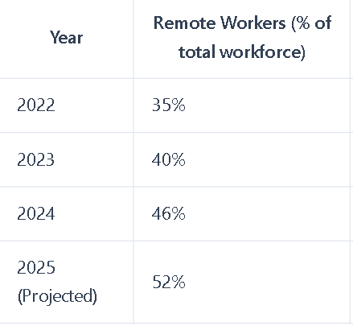

### البنك الأهلي السعودي

- عبدالحكيم الشنقيطي
- وائل عباس
- محمد عويض السهلي
- راكان الحربي
- محمد عبدالمجيد معافا

---

### عناصر الأصول و الخصوم و مصادر الإيرادات وأوجه الإنفاق

عبدالحكيم الشنقيطي

--!

### ما هي الأصول ؟ (الموجودات)

هي كيانات اقتصادية يمكن لمالكيها الحصول منها على منافع اقتصادية بحيازتها أو باستخدامها خلال فترة من الزمن

--!
#### إذا فما مقدار الأصول التي يمتلكها البنك الأهلي السعودي؟

في سنة 2022 كان إجمالي الأصول 945 مليار ريال سعودي  
<!-- .element: class="fragment" data-fragment-index="1" -->
 وزاد في السنة التالية بنسبة %12+ وأصبحت ترليون ريال 
 <!-- .element: class="fragment" data-fragment-index="2" -->  

--!

### صافي التمويل والسلف

وهي أكبر مصادر أموال البنوك وهي القروض وقد ارتفعت بنسبة 10%  
<!-- .element: class="fragment" data-fragment-index="1" -->
من 545 بليون الى 601 بليون ريال سعودي  خلال السنتين الماضية
<!-- .element: class="fragment" data-fragment-index="2" -->

--!
### استثمارات بالصافي 

من 258 بليون ريال إلى 269 بليون ريال زيادة 4%
<!-- .element: class="fragment" data-fragment-index="1" -->

ولنلقي نظرة على مثال لهذه الاستثمارات
<!-- .element: class="fragment" data-fragment-index="2" -->
--!

### استثمارات في بنوك أجنبية

<!-- .element: class="fragment" data-fragment-index="1" -->
وعلق أحد القراء على هذا الخبر فقال:
<!-- .element: class="fragment" data-fragment-index="2" -->

<!-- .element: class="fragment" data-fragment-index="2" -->
--!
### مثال على استثمار غير متوقع

في الوقت الذي تسببت فيه جائحة كورونا في إصابة الأسواق العالمية بالضعف في أوائل عام 2020
<!-- .element: class="fragment" data-fragment-index="1" -->
ضغط ولي العهد السعودي، بعد أن استشعر الفرصة، على صندوق الاستثمارات من أجل عملية شراء دولية للأسهم.
<!-- .element: class="fragment" data-fragment-index="2" -->
وقاوم مجلس إدارة الصندوق هذه الخطوة باعتبارها محفوفة بالمخاطر
<!-- .element: class="fragment" data-fragment-index="3" -->
Note: وفي ظل عدم وجود أصول سائلة كافية لإشباع رغبة الأمير في التحرك بسرعة، طلب الصندوق من البنك المركزي السعودي منحه عشرات المليارات من الدولارات  
قام بانتهاز الفرصة في وقت الجائحة والاستثمار الهائل الذي قام به في الشركات المتضررة عالميا 

--!
### الخصوم (المطلوبات)

1. ودائع العملاء

وهي أكبر خصوم البنك من 568 بليون ريال إلى 590 بليون ريال  
زيادة 4%  
<!-- .element: class="fragment" data-fragment-index="1" -->

Note:   وهذا شغل البنوك التجارية وجل عملها على أخذ أموال الناس والمتاجرة بها والاستثمار  

وأفضل مثال على ذلك الصحابي الجليل الزبير بن العوام 
--!

### الإيرادات

كان صافي دخل سنة (22) 18 بليون ريال   
<!-- .element: class="fragment" data-fragment-index="1" -->
وفي سنة (23) ارتفع بنسبة 11% الى 20 بليون ريال
<!-- .element: class="fragment" data-fragment-index="2" -->

--!

### دخل العمليات التشغيلية

دخل العمليات التشغيلية ارتفع من 33 بليون ريال الى 34 بليون 
<!-- .element: class="fragment" data-fragment-index="1" -->
- الاستشارات المالية 
<!-- .element: class="fragment" data-fragment-index="2" -->
- تسهيل تداول الأوراق المالية 
<!-- .element: class="fragment" data-fragment-index="3" -->
- صرف العملات 
<!-- .element: class="fragment" data-fragment-index="4" -->

Note: وهذا ليس تركيز البنك الأكبر لكنه يشكل مبلغ جيد بالنسبة للبنك
--!
## أوجه الإنفاق
--!

### المصاريف على ودائع العملاء

وهذا هو أكبر مصادر الإنفاق في هذه السنة وقد ارتفع بنسبة 175% !!!
<!-- .element: class="fragment" data-fragment-index="1" -->
من 8 بليون في 2022 الى 22 بليون في 2023
<!-- .element: class="fragment" data-fragment-index="2" -->
وكما ذكرنا من قبل أن هذا قد يعود الى أن البنك يخطط لفتح مشاريع واستثمارات جديدة لذلك يقوم بإنفاق هذه الأموال الهائلة
<!-- .element: class="fragment" data-fragment-index="3" -->
---

### الخدمات و أنواع القروض و طرق الاستثمار المقدمة من بنك الاهلي
وائل عباس  

--!
## الخدمات المقدمة
--!

### السحب النقدي الطارئ

إمكانية سحب مبلغ نقدي متى احتجت لذلك، حتى إن لم تكن بطاقة مدى بحوزتك يمكنك استخدام الدفع عبر الهاتف
<!-- .element: class="fragment" data-fragment-index="1" -->
--!

### عروض بطاقات الأهلي

​التخفيضات والعروض التي صممت خصيصاً لتلبي احتياجاتك مثل
<!-- .element: class="fragment" data-fragment-index="1" -->
- بطاقة كاش باك الائتمانية   

<!-- .element: class="fragment" data-fragment-index="2" -->
(استرد حتى 2% من القيمة النقدية لمشترياتك باستخدام البطاقة)  
<!-- .element: class="fragment" data-fragment-index="2" -->
وقد أفتى بجوازها معالي الشيخ سعد الشثري
<!-- .element: class="fragment" data-fragment-index="3" -->

--! 
### حسابات الأمانة

يوفر البنك الأهلي السعودي خدمة حسابات الأمانة، حيث يقوم البنك بدور وكيل حساب الأمانة عبر الأطراف المعنية في الاتفاقيات التجارية المتبادلة. 
<!-- .element: class="fragment" data-fragment-index="1" -->

--!
### خدمات سداد

-  سداد الفواتير المتكررة
<!-- .element: class="fragment" data-fragment-index="1" -->
- سداد فاتورة لمرة واحدة
<!-- .element: class="fragment" data-fragment-index="2" -->
- عرض تواريخ عمليات السداد واسترداد المدفوعات
<!-- .element: class="fragment" data-fragment-index="3" -->
--!
## أنواع القروض

--!
### التمويل الجديد

الحصول على السيولة النقدية الفورية لجميع القطاعات الحكومية والشركات الخاصة المعتمدة التي تحوّل رواتب موظفيها إلى البنك الأهلي عبر نظام "سريع" لتحويل الرواتب.
<!-- .element: class="fragment" data-fragment-index="1" -->

--!
### التمويل التكميلي

مع التمويل التكميلي، يمكنك زيادة مبلغ التمويل وفترة السداد بعد سداد 20٪ من تمويلك القائم.
<!-- .element: class="fragment" data-fragment-index="1" -->

--!

### التمويل الشخصي قصير الأجل

احصل على تمويل شخصي قصير الأجل لتغطية احتياجاتك الحالية، مع فترة سداد تصل إلى 12 شهراً.
<!-- .element: class="fragment" data-fragment-index="1" -->
--!

## أنواع الاستثمارات

--! 

### خيرات الأهلي 

مع خيرات الأهلي، يمكنك شراء السلع ومن ثم بيعها للبنك في أجل مسمى بسعر متفق عليه، مما يمكّنك من الاحتفاظ بأرباحك.
<!-- .element: class="fragment" data-fragment-index="1" -->
--!

### الاكتتاب أو زيادة رأس المال

الشركات التي ترغب في طرح أسهمها للاكتتاب العام أو زيادة رأسمالها. 
<!-- .element: class="fragment" data-fragment-index="1" -->

--! 

### الإجارة
يقوم البنك بنقل حق استخدام أحد الأصول أو العقارات إليك لفترة زمنية محددة مقابل دفع الإيجار.  
 <!-- .element: class="fragment" data-fragment-index="1" -->  

وفي نهاية فترة الإيجار، يمكنك اختيار نقل حق الملكية إلى شركتك.
<!-- .element: class="fragment" data-fragment-index="2" -->

--!
### المشاركة 

يقوم طرفان أو أكثر بالمشاركة في رأس مال مشروع والمشاركة في الأرباح والخسائر لهذا المشروع.  
<!-- .element: class="fragment" data-fragment-index="1" -->

---

### أهم المؤسسات المالية و الأدوات المالية في السوق السعودي

محمد عويض السهلي 

--!
## أهم المؤسسات المالية

--!

### هيئة السوق المالية (CMA):

الجهة المنظمة للسوق المالي السعودي، تُشرف على الأنظمة والقوانين لضمان العدالة والشفافية وحماية المستثمرين.
<!-- .element: class="fragment" data-fragment-index="1" -->

--!
### تداول (Tadawul):

السوق الرئيسي لتداول الأسهم والصكوك والسندات وصناديق الاستثمار المتداولة. تعد أكبر سوق مالية في المنطقة من حيث القيمة السوقية.
<!-- .element: class="fragment" data-fragment-index="1" -->
--! 

### البنك المركزي السعودي (SAMA):

يُنظم القطاع المصرفي ويُشرف على السيولة وأسعار الفائدة وسياسات النقد، بالإضافة إلى تنظيم البنوك وشركات التأمين.
<!-- .element: class="fragment" data-fragment-index="1" -->

--!
## أهم الأدوات المالية

--!
### الأسهم

تُعتبر الأسهم من الأدوات الأساسية في السوق السعودي، وهي متاحة للتداول في السوق الرئيسي وسوق نمو (المخصص للشركات الصغيرة والمتوسطة).
<!-- .element: class="fragment" data-fragment-index="1" -->

--!
### الصكوك والسندات

أدوات دين تُستخدم لجذب التمويل من الأفراد والمؤسسات، وتُعد وسيلة فعّالة لتنويع المحافظ الاستثمارية.
<!-- .element: class="fragment" data-fragment-index="1" -->
--!
### صناديق الاستثمار المتداولة (ETFs)

منتجات استثمارية تُتيح للمستثمرين الاستثمار في سلة من الأصول مثل الأسهم أو السندات.
<!-- .element: class="fragment" data-fragment-index="1" -->
--!
### صناديق الاستثمار العقارية المتداولة (REITs)

تُوفر فرصاً للاستثمار في القطاع العقاري مع تحقيق دخل دوري.
<!-- .element: class="fragment" data-fragment-index="1" -->
--!
### عقود المشتقات

مثل العقود المستقبلية وعقود الخيارات، وهي أدوات مالية مُصممة للتحوط أو الاستفادة من تحركات الأسعار.
<!-- .element: class="fragment" data-fragment-index="1" -->
---

### الدور الذي يؤديه البنك المركزي السعودي و البنوك التجارية في الطلب والعرض النقدي

محمد عبدالمجيد معافا 

--!

## أدوار البنك المركزي السعودي (ساما)

--!

### إصدار العملة والتحكم في العرض النقدي

البنك المركزي هو المسؤول عن إصدار الريال السعودي وتحديد كمية النقد المتداول في الاقتصاد، بما يضمن التوازن بين العرض والطلب النقدي.
<!-- .element: class="fragment" data-fragment-index="1" -->
--!
### السياسة النقدية

يستخدم أدوات السياسة النقدية (مثل أسعار الفائدة، عمليات السوق المفتوحة، واحتياطي البنوك) للسيطرة على التضخم، تعزيز النمو الاقتصادي، والحفاظ على استقرار العملة.
<!-- .element: class="fragment" data-fragment-index="1" -->

على سبيل المثال، يمكنه رفع أو خفض أسعار الفائدة الأساسية لتقليل أو زيادة الطلب على القروض.
<!-- .element: class="fragment" data-fragment-index="2" -->
--!
### إدارة الاحتياطي النقدي

يحدد نسبة الاحتياطي الإلزامي الذي يجب على البنوك التجارية الاحتفاظ به، مما يؤثر بشكل مباشر على قدرة البنوك على تقديم القروض.
<!-- .element: class="fragment" data-fragment-index="1" -->

--!
### التأثير على الطلب الكلي

يعمل على تحقيق استقرار الأسعار ومراقبة التضخم، مما يؤثر على القوة الشرائية للمواطنين ومستوى الطلب النقدي.
<!-- .element: class="fragment" data-fragment-index="1" -->

--!
## أدوار البنوك التجارية

--!
### تقديم القروض والائتمان

تلعب البنوك التجارية دورًا أساسيًا في خلق النقود من خلال تقديم القروض. عندما تمنح القروض، تزيد كمية النقد المتاح في الاقتصاد، ما يؤثر على العرض النقدي.
<!-- .element: class="fragment" data-fragment-index="1" -->

--!
### دعم الاستثمارات والأعمال

تسهم في تمويل المشاريع الاقتصادية المختلفة، مما يزيد الطلب على النقد بسبب الاحتياجات التمويلية للشركات والأفراد.
<!-- .element: class="fragment" data-fragment-index="1" -->

--!
### تنظيم عمليات الادخار والإنفاق

توفر حسابات ادخار واستثمار تسهم في تقليل أو زيادة العرض النقدي المتاح للاقتصاد حسب ميول الادخار لدى العملاء.
<!-- .element: class="fragment" data-fragment-index="1" -->
--!
### التأثير على النشاط الاقتصادي

تؤثر السياسات التي تتبعها البنوك في الإقراض والتمويل على مستوى النشاط الاقتصادي بشكل عام، وبالتالي على الطلب النقدي.
<!-- .element: class="fragment" data-fragment-index="1" -->
--! 
### التفاعل مع السياسات النقدية للبنك المركزي

تتأثر البنوك التجارية بسياسات البنك المركزي (مثل تغيير سعر الفائدة أو نسبة الاحتياطي الإلزامي)، وتعمل وفق هذه السياسات لضمان استقرار النظام النقدي.
<!-- .element: class="fragment" data-fragment-index="1" -->
--!
### التنسيق بين البنك المركزي والبنوك التجارية

- يقوم البنك المركزي السعودي بمراقبة نشاط البنوك التجارية
<!-- .element: class="fragment" data-fragment-index="1" -->
ويضع القوانين والأنظمة التي تنظم عملها
<!-- .element: class="fragment" data-fragment-index="1" -->

- يسعى الطرفان لتحقيق الأهداف الاقتصادية للمملكة، مثل تقليل البطالة، رفع كفاءة الاقتصاد، وتحقيق رؤية المملكة 2030.
<!-- .element: class="fragment" data-fragment-index="2" -->
---

### مقارنة بين ميزانية البنك التجاري و ميزانية شركة التأمين

راكان الحربي

--! 
## مقارنة الأصول

--!

### البنك التجاري

المكونات  
<!-- .element: class="fragment" data-fragment-index="1" -->
تشمل الأصول القروض الممنوحة للشركات والأفراد، الاستثمارات في الأوراق المالية، والنقد والأرصدة لدى البنوك الأخرى
<!-- .element: class="fragment" data-fragment-index="2" -->

النطاق  
<!-- .element: class="fragment" data-fragment-index="3" -->

تتضمن الأصول التزامات تمويل المشاريع الكبرى والشركات الكبيرة
<!-- .element: class="fragment" data-fragment-index="4" -->
--!

### شركة التأمين

المكونات  
<!-- .element: class="fragment" data-fragment-index="1" -->
تشمل الأصول الاحتياطيات النقدية، استثمارات في الأوراق المالية، والعقارات
<!-- .element: class="fragment" data-fragment-index="2" -->

النطاق  
<!-- .element: class="fragment" data-fragment-index="3" -->
تركز الأصول على توفير الموارد المالية لتغطية المطالبات التأمينية المستقبلية
<!-- .element: class="fragment" data-fragment-index="4" -->

--!
## الالتزامات
--!

### البنك التجاري

المكونات  
<!-- .element: class="fragment" data-fragment-index="1" -->
تشمل الالتزامات الودائع من العملاء، القروض من البنوك الأخرى، وإصدارات السندات
<!-- .element: class="fragment" data-fragment-index="2" -->
المستوى  
<!-- .element: class="fragment" data-fragment-index="3" -->
الالتزامات غالبًا ما تكون مرتفعة نظرًا لتمويل المشاريع الكبيرة
<!-- .element: class="fragment" data-fragment-index="4" -->

--!

### شركة التأمين

المكونات  
<!-- .element: class="fragment" data-fragment-index="1" -->
تشمل الالتزامات الاحتياطيات للتأمين، والمطالبات المستحقة، وإعادة التأمين
<!-- .element: class="fragment" data-fragment-index="2" -->
المستوى  
<!-- .element: class="fragment" data-fragment-index="3" -->
الالتزامات تشمل توقعات دفع المطالبات المستقبلية
<!-- .element: class="fragment" data-fragment-index="4" -->
--!
## الإيرادات
--!

### البنك التجاري

المصادر  
<!-- .element: class="fragment" data-fragment-index="1" -->
تعتمد الإيرادات على الفوائد المكتسبة من القروض والخدمات المقدمة للشركات
<!-- .element: class="fragment" data-fragment-index="2" -->
الاستقرار 
<!-- .element: class="fragment" data-fragment-index="3" --> 
قد تكون الإيرادات متقلبة بناءً على أداء المشاريع الكبيرة
<!-- .element: class="fragment" data-fragment-index="4" -->

--!
### شركة التأمين

المصادر  
<!-- .element: class="fragment" data-fragment-index="1" -->
تعتمد الإيرادات على الأقساط التأمينية المستلمة، والفوائد على الاستثمارات
<!-- .element: class="fragment" data-fragment-index="2" -->
الاستقرار 
<!-- .element: class="fragment" data-fragment-index="3" --> 
تكون الإيرادات أكثر استقرارًا نظرًا للتنوع في أنواع التأمين
<!-- .element: class="fragment" data-fragment-index="4" -->

--!
## الأرباح
--!
### البنك التجاري

المصادر  
<!-- .element: class="fragment" data-fragment-index="1" -->
تعتمد الأرباح على الفرق بين الفوائد المكتسبة من القروض والفوائد المدفوعة على الودائع
<!-- .element: class="fragment" data-fragment-index="2" -->
الاستقرار  
<!-- .element: class="fragment" data-fragment-index="3" -->
تحقق الأرباح إذا كانت الإدارة فعالة في إدارة المخاطر
<!-- .element: class="fragment" data-fragment-index="4" -->

--!

### شركة التأمين

المصادر  
<!-- .element: class="fragment" data-fragment-index="1" -->
تعتمد الأرباح على الفرق بين الأقساط التأمينية المستلمة والمطالبات المدفوعة، بالإضافة إلى عوائد الاستثمارات
<!-- .element: class="fragment" data-fragment-index="2" -->
الاستقرار  
<!-- .element: class="fragment" data-fragment-index="3" -->
تكون الأرباح مستقرة عادةً نظراً لتوزيع المخاطر على نطاق واسع
<!-- .element: class="fragment" data-fragment-index="4" -->

--!

## النقاط المشتركة والفارقة

--!

### النقاط المشتركة  

كلا المؤسستين يعتمد على الفوائد المكتسبة من الاستثمارات كأحد المصادر الرئيسية للإيرادات
<!-- .element: class="fragment" data-fragment-index="1" -->
كلاهما يستخدم استثمارات في الأوراق المالية والنقد والأرصدة كجزء من الأصول
<!-- .element: class="fragment" data-fragment-index="2" -->
--!

### النقاط الفارقة  

 
البنك التجاري يركز على تمويل المشاريع الكبيرة والشركات
<!-- .element: class="fragment" data-fragment-index="1" -->
بينما تركز شركة التأمين على تقديم التغطية التأمينية للأفراد والشركات
<!-- .element: class="fragment" data-fragment-index="2" -->
--!

### حجم الالتزامات والأصول  

تكون الالتزامات والأصول للبنك التجاري أكبر بسبب تمويل المشاريع الضخمة  
<!-- .element: class="fragment" data-fragment-index="1" -->
بينما تكون متوسطة في شركة التأمين
<!-- .element: class="fragment" data-fragment-index="2" -->
--!
### الاستقرار المالي
تعتبر إيرادات شركة التأمين أكثر استقرارًا نظرًا لتنوع أنواع التأمين والمخاطر المغطاة
 <!-- .element: class="fragment" data-fragment-index="1" -->
بينما إيرادات البنك التجاري محفوفة بالمخاطر وأكثر عرضة للفشل
<!-- .element: class="fragment" data-fragment-index="2" -->

---

## خاتمة

---

## رابط العرض التقديمي  [t.ly/uGRrW](https://t.ly/uGRrW)

   

--!
## رابط العرض التقديمي بصيغة ملف نصي  [t.ly/4U-zo](https://t.ly/4U-zo)

  
